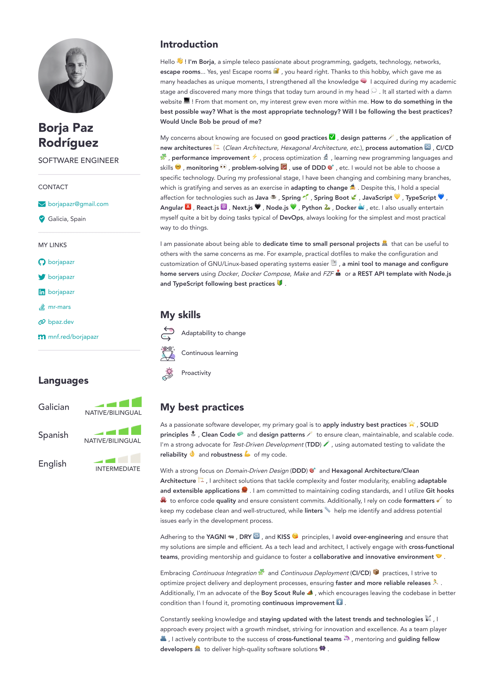
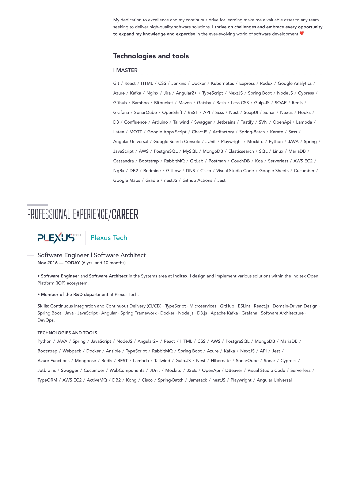
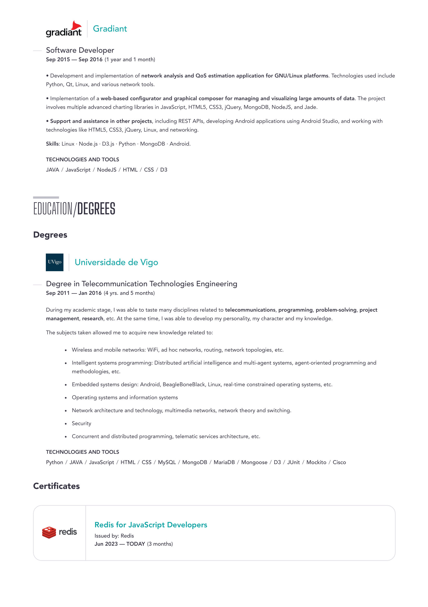

# 📑 Resume

My Personal CV written in LaTeX using [Awesome CV](https://github.com/posquit0/Awesome-CV).

## 🎑 Preview

## 🤩 Inspiration

* <https://github.com/posquit0/Awesome-CV> Thank you very much for your great work!

## ⚖️ License

The MIT License (MIT). Please see [License](LICENSE) for more information.
